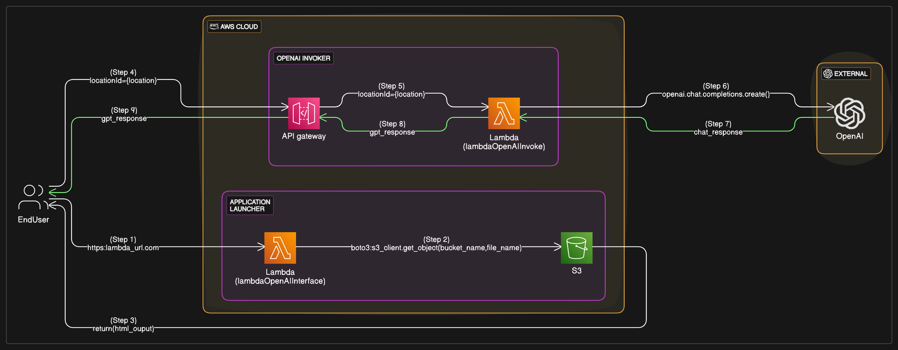

# Lambda-OpenAI-Interface-Example-2

Lambda-OpenAI-Inteferace-App-Example-2

[](https://platform.openai.com/)
[](https://aws.amazon.com/)
[](https://www.python.org/)
<BR>

# Description

This is continuation of previous one, [example-1](https://github.com/ecirams/Lambda-OpenAI-Interface-Example1).

It is simple [AWS Serverless](https://aws.amazon.com/serverless/) - [Lambda](https://aws.amazon.com/lambda/) based python application to open HTML file (stored in S3 Bucket) with a form to select a variable, location to select and send to OpenAI endpoint. On submission, another [Lambda](https://aws.amazon.com/lambda/) python application will be invoked, with a simple interface to Open AI to get interesting facts of a defined location. It is implementation of [example applications](https://platform.openai.com/examples) found in the official OpenAI API documentation.

This is a second practice example to start learning to implement Serverless application.

# Architecture

Below is the architecture diagram with flow of data across the different components of AWS

[Architecture diagram](./docs/lambda-openai-interface-example2-arch.png) 

# Quick Start

Works with Linux, Windows, and macOS environments

1. Verify Project requirements: [AWS Account](https://aws.amazon.com/free/) and [Python 3.11](https://www.python.org/). For those who wants to use AWS CLI, then [CLI](https://aws.amazon.com/cli/) access.

### Implementation Steps

```
1. Create S3 Bucket and upload files like
   index.html, script.js and style.js
2. Create policy (bucket_policy.json) for the bucket
   for any resource (lambda) to get object.
3. Create first lambda function with code from
   lambda_Landing_Page.py and create function URL.
   Alternatively, s3 bucket static web hosting can be done
4. Create second lambda function with code from
   lambdaToOpenAI.py;
   Ensure OpenAI libraries are uploaded as a zip file;
   Change Timeout to 40 sec (to accommodate  the time to
   get response from OpenAI)
   set environment variable API_KEY with key got from
   platform.openai.com
5. Create an API with GET method
   Method request - URL query string parameter - locationId
   Integration request - Integration type Lambda and select the lambdaOpenAIIInvoke, request body pass through with URL string parameters with mapping template
   {
    "locationId": "$input.params('locationId')"
   }


```
